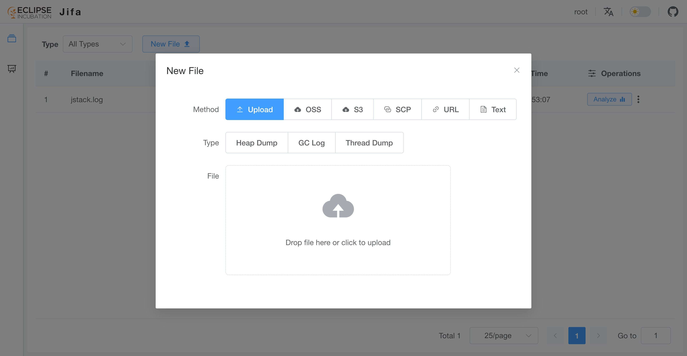
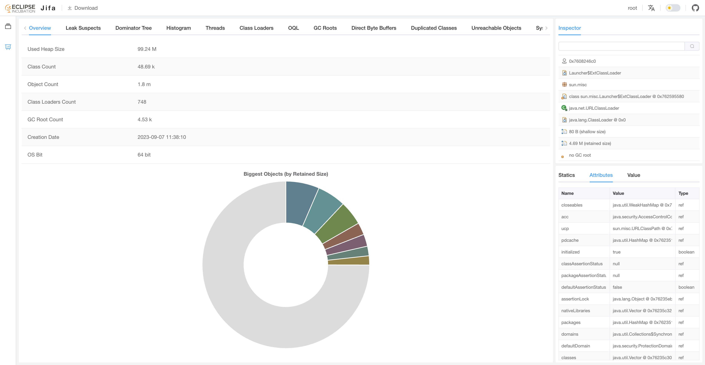

# What is Eclipse Jifa?

## Introduction

Eclipse Jifa (abbreviated as Jifa) stands for "**J**ava **I**ssues **F**inding **A**ssistant".
This project originated from an internal system which was designed to improve the efficiency of diagnosing Java heap related issues that occurred in the production environment.

Currently, Jifa primarily supports the following features:

- [Heap Dump Analysis](./heap-dump-analysis.md)
- [GC Log Analysis](./gc-log-analysis.md)
- [Thread Dump Analysis](./thread-dump-analysis.md)

In terms of the design, Jifa consists of two main parts:

- **Server**: a standard SpringBoot 3 application.

- **Web UI**: based on Vue 3, Element Plus and other packages.

<div class="info custom-block" style="padding-top: 8px">
In earlier versions, <b>Server</b> was implemented using Eclipse Vert.x, and <b>Web UI</b> was implemented using Vue 2 and Element UI.
</div>

## How to Use?

The main usage workflow consists of three steps: **obtaining files**, **uploading files**, and **analyzing files**.

Taking the analysis of a heap dump as an example, users can initiate an analysis through the following steps:

1. Obtain a heap dump. Users can generate a new heap dump using commands such as `jmap` or `jcmd`.

   ::: code-group
   ```shell [jmap]
   $ jmap -dump:format=b,file=<file> <pid>
   ```
   ```shell [jcmd]
   $ jcmd <pid> GC.heap_dump filename=<file>
   ```
   :::

2. Upload the heap dump to Jifa. Currently, various transfer methods are supported, including local file upload,
as well as uploading through cloud storage solutions such as S3.

   

3. Do analysis.

   