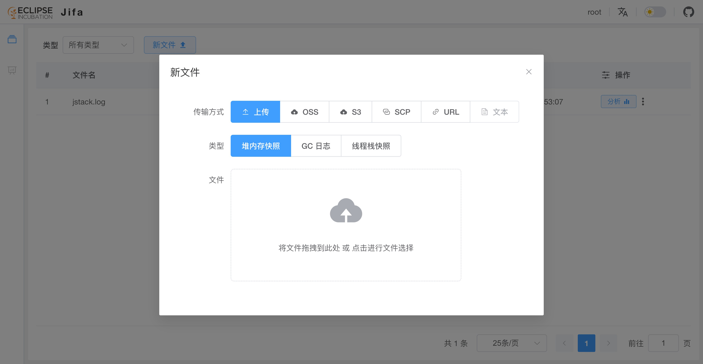
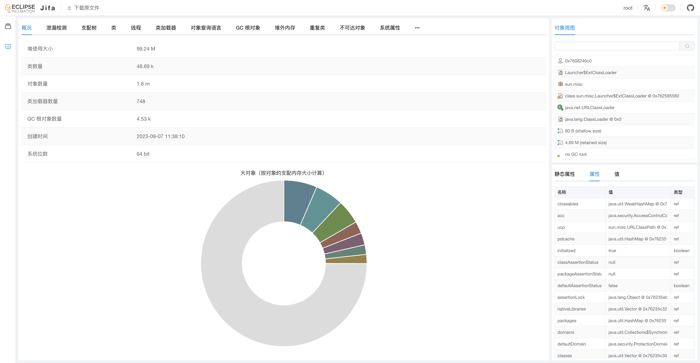

# Eclipse Jifa 是什么？

## 简介

Eclipse Jifa（简称 Jifa）的名字由 “**J**ava **I**ssues **F**inding **A**ssistant” 的首字母组成。
项目起源于一个内部的在线系统，被设计用于提高生产环境 Java 应用堆泄漏等问题的排查效率。于 2020 年开源并贡献给 Eclipse 基金会。

目前主要包含以下功能：

- [堆快照分析](./heap-dump-analysis.md)
- [GC 日志分析](./gc-log-analysis.md)
- [线程快照分析](./thread-dump-analysis.md)
- [JFR分析](./jfr-analysis.md)

在设计上，由两部分组成：

- **服务端**： 标准的 SpringBoot 3 应用。

- **Web UI**：基于 Vue 3 和 Element Plus 等框架实现。

<div class="info custom-block" style="padding-top: 8px">
在早期版本中，<b>服务端</b>基于 Eclipse Vert.x 实现，<b>Web UI </b>基于 Vue 2 和 Element UI 实现。
</div>

## 使用方式

使用流程由**获取文件**、**上传文件**和**分析文件**三个步骤组成。

以分析堆快照为例，用户可以通过以下步骤开始一次分析：

1. 获取堆快照文件。用户可以通过 `jmap` 或 `jcmd` 等命令生成一个新的快照文件。

   ::: code-group
   ```shell [jmap]
   $ jmap -dump:format=b,file=<file> <pid>
   ```
   ```shell [jcmd]
   $ jcmd <pid> GC.heap_dump filename=<file>
   ```
   :::

2. 上传堆快照文件。支持多种上传方式，如本地文件上传、通过 OSS 上传。

   

3. 着手进行分析。

   